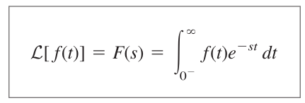
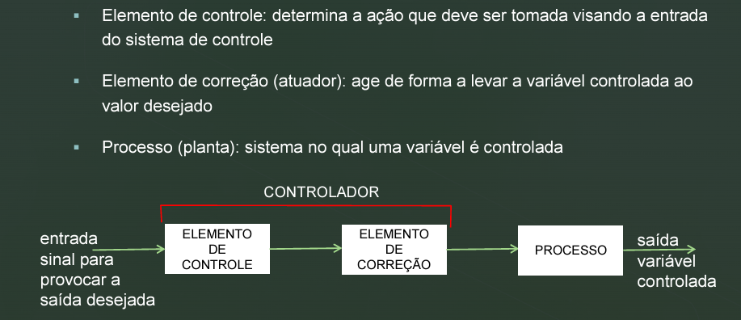

## Transformada de Laplace ##

A transformada de Laplace é usada para converter uma função que está no domínio do tempo para o domínio da frequência de forma a ser possível a utilização para resolução de problemas.

Onde o 's' é uma variável complexa dada por X+JY. Ao utilizar tabelas podemos fazer a transformada inversa de laplace e transformar uma função que está definida no domínio da frequência para o domínio do tempo.

## Sistema de Malha Aberta
A entrada é escolhida com base na experiência de tal forma que dê o valor desejado na saída.

Exemplo 2: máquina de lavar roupas
§ Entrada: roupas sujas 
§ Ajuste por meio de dia e/ou botões: ajuste de acordo com tipo de tecido e forma da lavagem desejada -  não se altera de acordo com as condições das roupas 
§ Saída: roupas (teoricamente) limpas 
§ Seguirá o mesmo procedimento independentemente das roupas estarem mais ou menos sujas

## Sistema em Malha fechada
